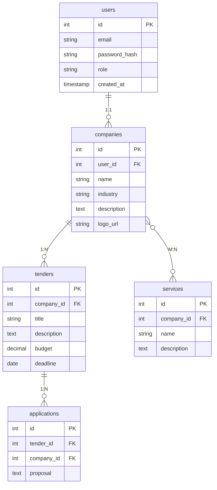
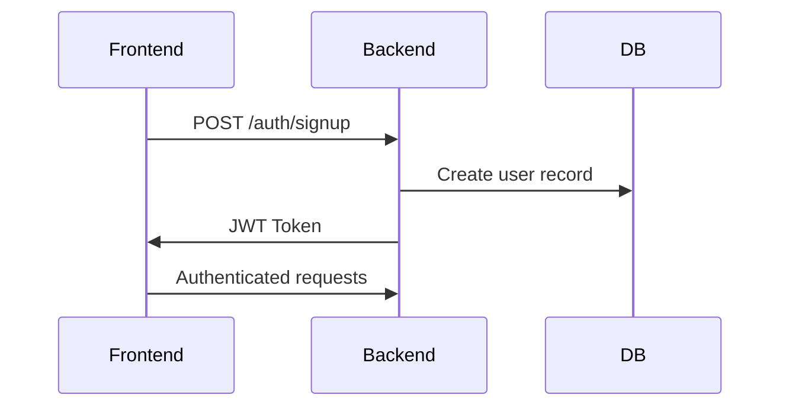

```
# B2B Tender Management Platform

A full-stack solution for companies to manage tenders and business collaborations, built as part of a 5-day internship challenge.

## Features

### Core Functionality
- ✅ Company registration and profile management
- ✅ Tender creation and publishing
- ✅ Browse and apply to tenders
- ✅ Advanced company search (name/industry/services)
- ✅ Company profile viewing with complete details

### Technical Implementation
- **Authentication**: JWT-based secure access
- **Storage**: Supabase integration for logo/image uploads
- **Search**: Efficient server-side filtering
- **Pagination**: Optimized tender listings

## Technology Stack

### Frontend
- Next.js (TypeScript)
- Static and Server-side Rendering
- Client-side form validation

### Backend
- Express.js (TypeScript)
- Modular route architecture
- Zod input validation
- Secure error handling

### Database & Infrastructure
- PostgreSQL with proper migrations
- Supabase Storage for media
- Dockerized environment (optional bonus)

## Database Schema



## Setup Instructions

### Prerequisites
- Node.js v16+
- PostgreSQL
- Supabase account (for storage)

### Installation
```bash
# Clone repository
git clone https://github.com/daveontrack/B2B.git
cd B2B

# Install dependencies
cd backend && npm install
cd ../frontend && npm install

# Configure environment variables
cp .env.example .env
```

### Database Setup
```bash
# Run migrations
cd backend
npx knex migrate:latest

# Seed initial data (optional)
npx knex seed:run
```

### Running the Application
```bash
# Using Docker (recommended)
docker-compose up -d

# Manual startup
cd backend && npm run dev
cd ../frontend && npm run dev
```

## API Documentation

### Authentication Flow


### Key Endpoints
- `POST /auth/login` - User authentication
- `GET /companies?search=` - Company search
- `POST /tenders` - Create new tender
- `GET /tenders?page=` - Paginated tender listings

## Deployment

The application can be deployed with:
- Frontend: Vercel
- Backend: Heroku/Railway
- Database: Supabase/Amazon RDS

Example deployment commands:
```bash
# Frontend deployment to Vercel
vercel --prod

# Backend deployment to Heroku
git push heroku main
```

## Demo Links
- Video Walkthrough: [Loom Video](https://loom.com/share/b234)

## Challenges & Solutions

1. **File Upload Handling**
   - Implemented pre-upload validation
   - Added error recovery for failed uploads

2. **Search Performance**
   - Used PostgreSQL full-text search
   - Added composite indexes for common queries

3. **Type Sharing**
   - Created shared types package in monorepo
   - Automated type generation for frontend

## Future Improvements
- Real-time notifications
- Tender application tracking
- Enhanced search filters
- Mobile-responsive design

---
Developed by Dawit Mengesha for Full-Stack Developer Internship position
```
